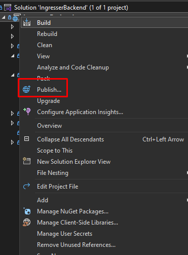
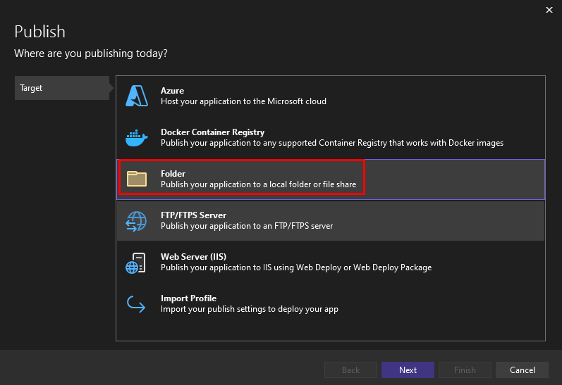
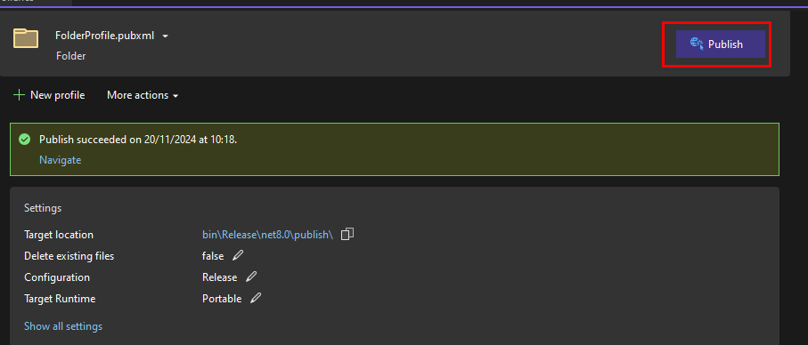
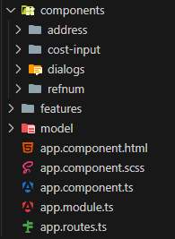
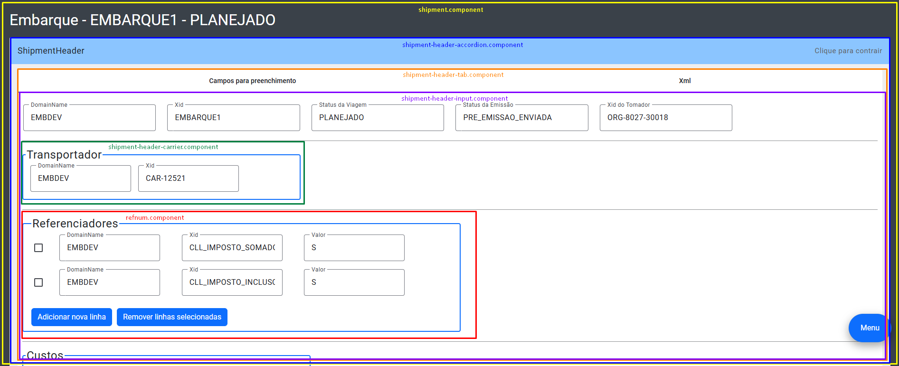

# Ingresser

Evolução do Regresser, para ter um visual mais agradável, sem instalações locais ou de containers. Mas ainda fazendo o envio de Embarques e Documentos para ambientes 😊!

Criado com [Angular](https://github.com/angular/angular-cli) versão 18.2.1 no Frontend, e [.NET](https://dotnet.microsoft.com/pt-br/download/dotnet) 8 no Backend.

---

### Colocando as novas atualizações no servidor

Depois de atualizar o front e o backend, é preciso colocar as alterações no servidor, então para isso:

- Primeiro pare a aplicação no IIS;
- Frontend: 
  - Executar o comando `ng build` ou `npm run ng build`;
  - Isso irá criar uma pasta `dist` dentro da raiz do Frontend;
  - Pegar todo o conteúdo que estiver nessa pasta e colocar lá no servidor na pasta `C:\Sites\Ingresser\client`;

- Backend: 
  - Clique com o botão direito no projeto e vá em Publish;
  
  - Selecione a opção de publicar numa pasta;
  
  - Escolha a pasta para publicação e vá em Finish;
  
  - Clique no botão de Publish para publicar na pasta;
  
  - Pegar todo o conteúdo que estiver nessa pasta e colocar lá no servidor na pasta `C:\Sites\Ingresser\api`;
- Inicie novamente a aplicação no IIS e pronto!

---

### Estrutura do Frontend

#### Primeiro nível de pastas

As pastas do primeiro nível são:
- components: onde tem componentes reutilizados em mais de um local;
- features: pasta com a parte principal dos componentes;
- model: classes de domínio e enums.

Além disso, nesse nível está o `app.component` que contém a "cara" inicial do regresser: logo, nome, menu principal e ação de enviar.

#### Subpastas de features

É dentro da pasta features que estarão as principais ações e componentes que o Ingresser pode criar e enviar ao ambiente.

A estrutura de pastas geralmente seguem a mesma lógica dos componentes da tela. Por exemplo vamos ver o `shipment-header` do embarque:

- O `shipment.component` é a pasta mais externa, onde dentro temos todas os outros componentes do embarque (`header`, `header2`, `shipment-stop`, etc.);
  - Entrando na pasta do `shipment.header`, terá o `accordion`, para expandir e contrair a visualização;
     - Em seguida temos a pasta `tab` para controlar as abas de `Campos para preenchimento` e `Xml`;
       - Depois temos a pasta `input`, que ai sim terá todos os campos para preenchimento, incluindo outros componentes externos, como o `refnum.component` na imagem de exemplo.

Assim, de forma geral temos a estrutura: `component -> accordion -> tab -> input`.

